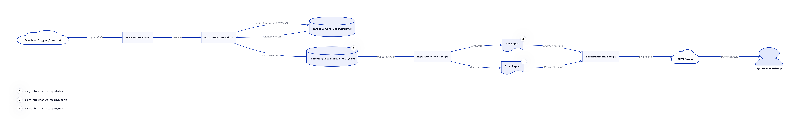

# Daily Infrastructure Report Project: System Architecture

## 1. Introduction

This document details the proposed system architecture for the Daily Infrastructure Report Project. The architecture is designed to be modular, scalable, and robust, ensuring efficient data collection, report generation, and automated distribution. It outlines the key components and their interactions, providing a clear blueprint for implementation.

## 2. High-Level Architecture Overview

The Daily Infrastructure Report system will operate as a scheduled, automated process. At a high level, it consists of three main stages:

1.  **Data Collection:** Scripts will connect to various infrastructure components (servers) to gather required metrics.
2.  **Data Processing and Report Generation:** Collected data will be processed, aggregated, and formatted into daily reports (PDF and Excel).
3.  **Report Distribution:** Generated reports will be automatically emailed to the designated system administration group.

## 3. Detailed Component Breakdown

### 3.1. Orchestration and Scheduling Module

This module is the central control point for the entire system. It will be responsible for:

*   **Scheduler:** A cron job (or similar task scheduler) will trigger the main script daily at a predefined time (e.g., early morning).
*   **Main Script:** A Python script will orchestrate the execution of data collection, report generation, and email distribution modules in sequence.

### 3.2. Data Collection Module

This module comprises several specialized scripts, each focused on gathering a specific type of data from target servers. These scripts will be developed primarily in Python, leveraging standard libraries or secure shell commands.

*   **Server Connectivity:** Utilizes SSH (Secure Shell) for secure remote execution of commands on Linux servers. For Windows servers, alternative secure methods like WinRM or PowerShell remoting will be considered if applicable within the organization's environment.
*   **Running Servers Script:** Queries server management platforms (if available and accessible) or executes commands (e.g., `uptime`, `systemctl status`) on individual servers to determine their operational status and count.
*   **Disk Usage Script:** Executes commands (e.g., `df -h` on Linux, `Get-WmiObject Win32_LogicalDisk` on Windows) to retrieve disk space utilization for all mounted filesystems.
*   **User Logins Script:** Parses `/var/log/secure` (or equivalent) on Linux servers to extract login events. This script will need to handle log file rotation and process only relevant entries from the last 24 hours.
*   **System Uptime Script:** Executes commands (e.g., `uptime` on Linux) to get the server uptime.
*   **Temporary Data Storage:** Collected raw data from each script will be temporarily stored in a structured format (e.g., JSON, CSV) in a designated directory within the project structure, before being consumed by the report generation module.

### 3.3. Data Processing and Report Generation Module

This module takes the collected raw data, processes it, and transforms it into presentable reports.

*   **Data Aggregation and Transformation:** A Python script will read the temporary data files, aggregate information, perform necessary calculations (e.g., percentage disk usage), and structure the data for reporting.
*   **PDF Report Generator:** Utilizes a Python library (e.g., `ReportLab`, `fpdf2`) to create a professional-looking PDF document. This report will provide a summary view with key metrics and potentially high-level charts.
*   **Excel Report Generator:** Utilizes a Python library (e.g., `openpyxl`, `pandas` with `xlsxwriter`) to create a detailed Excel spreadsheet. This report will contain raw and processed data in tabular format, allowing for further analysis and filtering by administrators.
*   **Report Templates:** Pre-designed templates (for both PDF and Excel) will ensure consistency in report layout and branding.

### 3.4. Report Distribution Module

This module handles the secure and automated delivery of the generated reports.

*   **Email Client Integration:** A Python script will use the `smtplib` library (or similar) to connect to the organization's SMTP server.
*   **Email Content Generation:** The script will construct the email, including a clear subject line (e.g., 

Daily Infrastructure Report - YYYY-MM-DD), a brief body message, and attach both the PDF and Excel reports.
*   **Recipient Management:** The email addresses of the system administration group will be configurable, likely stored in a configuration file.

## 4. Data Flow

1.  **Scheduled Trigger:** The cron job initiates the main Python script.
2.  **Data Collection:** The main script executes individual data collection scripts on target servers via SSH.
3.  **Temporary Storage:** Collected data is saved to temporary files (e.g., JSON, CSV) in the `daily_infrastructure_report/data` directory.
4.  **Data Processing:** The report generation script reads data from temporary files, processes it, and prepares it for reporting.
5.  **Report Generation:** PDF and Excel reports are generated and saved to the `daily_infrastructure_report/reports` directory.
6.  **Email Distribution:** The email script attaches the generated reports and sends them to the configured recipient list via SMTP.

## 5. Technology Stack

*   **Programming Language:** Python 3.x
*   **Scheduling:** Cron (Linux)
*   **Remote Execution:** SSH (via `paramiko` or `subprocess` with `ssh` command)
*   **PDF Generation Library:** `fpdf2` or `ReportLab`
*   **Excel Generation Library:** `openpyxl` or `pandas` with `xlsxwriter`
*   **Email:** `smtplib` (Python standard library)
*   **Configuration:** INI files or JSON files for easy configuration.

## 6. Security Considerations

*   **SSH Key Management:** SSH keys used for server access will be stored securely with appropriate permissions and potentially encrypted.
*   **Least Privilege:** Data collection scripts will run with the minimum necessary privileges on target servers.
*   **Secure Communication:** All communication with target servers will use secure protocols (SSH).
*   **Sensitive Data Handling:** User login data will be processed carefully, ensuring only necessary information is extracted and stored temporarily.

## 7. Future Enhancements

*   **Database Integration:** For long-term data storage and trend analysis, integrating with a database (e.g., SQLite, PostgreSQL) could be considered.
*   **Web Dashboard:** A simple web dashboard could be developed to visualize historical data and provide an on-demand view of infrastructure health.
*   **Alerting:** Integration with an alerting system for critical thresholds (e.g., disk space exceeding 90%).

## 8. Conclusion

This architectural design provides a robust and extensible framework for the Daily Infrastructure Report Project. By adhering to this structure, the implementation will be streamlined, leading to a reliable and efficient solution for infrastructure monitoring and reporting.

### Data Flow Diagram

## 5. Technology Stack Choices Justification

### 5.1. Python 3.x

Python was chosen as the primary programming language due to its extensive ecosystem of libraries, readability, and versatility. It offers robust support for system automation, file manipulation, data processing, and network communication, making it ideal for this project. Key libraries that will be utilized include:

*   **`paramiko`:** For secure SSH connectivity and command execution on remote Linux servers. This library provides a programmatic way to interact with SSH, enabling secure and authenticated communication without relying on external shell commands that might be less secure or harder to manage.
*   **`fpdf2` or `ReportLab`:** For generating PDF reports. Both are powerful libraries for creating PDF documents from scratch, offering fine-grained control over layout, text, and graphics. The choice between them will depend on specific formatting needs and ease of integration during implementation.
*   **`openpyxl` or `pandas` with `xlsxwriter`:** For generating Excel reports. `openpyxl` is excellent for direct manipulation of `.xlsx` files, while `pandas` combined with `xlsxwriter` provides powerful data manipulation capabilities before writing to Excel, which is beneficial for complex data aggregation.
*   **`smtplib`:** Python's built-in library for sending emails using the Simple Mail Transfer Protocol (SMTP). This ensures native and efficient email distribution without external dependencies.
*   **Standard Libraries:** `os`, `sys`, `json`, `csv`, `datetime` for file system operations, data handling, and time management.

### 5.2. Cron (Linux Scheduling)

Cron was selected for scheduling the daily execution of the report generation system due to its ubiquity, reliability, and simplicity in Linux environments. It is a well-understood and stable utility for automating repetitive tasks at fixed times or intervals. Its native integration with the operating system ensures minimal overhead and high compatibility.

### 5.3. SSH (Secure Shell)

SSH is the chosen protocol for secure communication and command execution on remote Linux servers. It provides strong encryption and authentication mechanisms, ensuring that data collected from servers is transmitted securely and that only authorized commands are executed. This aligns with the project's security requirements.

### 5.4. Configuration Files (INI/JSON)

INI or JSON files will be used for storing configuration parameters such as server lists, email recipient addresses, and thresholds. This approach offers several advantages:

*   **Readability:** Both formats are human-readable, making it easy for administrators to understand and modify configurations.
*   **Flexibility:** Allows for easy updates to parameters without modifying the core codebase.
*   **Separation of Concerns:** Keeps sensitive or frequently changing data separate from the application logic, improving maintainability and security.

## 6. Development Environment

The development and deployment environment will primarily be Linux-based, leveraging standard command-line tools and Python package management (`pip`). A virtual environment will be used during development to manage dependencies and ensure project isolation.

## 7. Conclusion

The selected technology stack provides a robust, secure, and efficient foundation for the Daily Infrastructure Report Project. Each component has been chosen for its reliability, performance, and suitability for the specific requirements of automated infrastructure monitoring and reporting.

