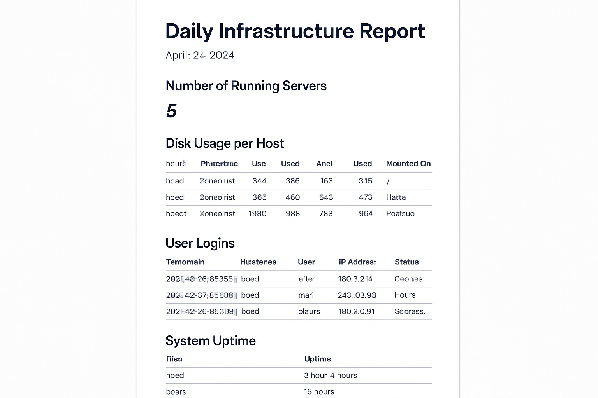
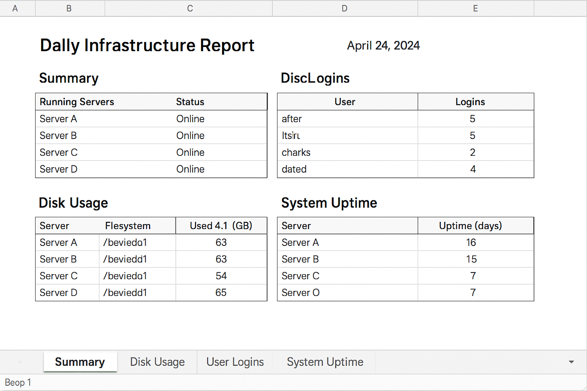

# Daily Infrastructure Report Project: User Manual

## 1. Introduction

This user manual provides comprehensive guidance on the deployment, configuration, and operation of the Daily Infrastructure Report project. Designed for system administrators and IT professionals, this solution automates the collection of critical server metrics, generates detailed reports in both PDF and Excel formats, and distributes them via email. The primary goal of this project is to streamline daily monitoring tasks, provide timely insights into system health, and enhance proactive problem identification within an organizational infrastructure.

### 1.1. Purpose and Scope

The Daily Infrastructure Report project aims to centralize and automate the reporting of key infrastructure data points, including the number of running servers, disk usage per host, user login activities from `/var/log/secure`, and system uptime. By automating these processes, organizations can significantly reduce manual effort, minimize human error, and ensure consistent, accurate reporting. The scope of this manual covers the entire lifecycle of the project, from initial setup and configuration to daily operation, troubleshooting, and maintenance.

### 1.2. Key Features

*   **Automated Data Collection:** Gathers essential metrics from multiple servers without manual intervention.
*   **Multi-format Reporting:** Generates reports in widely accessible PDF and Excel formats for diverse analytical needs.
*   **Automated Email Distribution:** Delivers daily reports directly to a predefined group of system administrators, ensuring timely dissemination of critical information.
*   **Configurable Settings:** Allows easy customization of server details, email recipients, and report paths via a centralized configuration file.
*   **Modular Design:** Built with Python scripts, enabling easy extension and integration with existing systems.

### 1.3. Target Audience

This manual is intended for:

*   **System Administrators:** Responsible for deploying, configuring, and maintaining the infrastructure reporting system.
*   **IT Managers:** Who need to understand the capabilities and outputs of the system for oversight and decision-making.
*   **Technical Support Staff:** Who may use the reports for initial diagnostics and troubleshooting.

### 1.4. Document Structure

This manual is organized into the following sections:

*   **Introduction:** Overview of the project, its purpose, features, and target audience.
*   **System Requirements:** Details the necessary hardware, software, and network prerequisites.
*   **Installation Guide:** Step-by-step instructions for setting up the project environment.
*   **Configuration:** Explains how to customize the project settings to fit specific infrastructure needs.
*   **Usage:** Describes how to run the data collection, report generation, and email distribution processes.
*   **Automation and Scheduling:** Provides instructions for automating the daily report generation using cron jobs.
*   **Troubleshooting:** Offers solutions to common issues and error scenarios.
*   **Maintenance and Updates:** Guidelines for keeping the system running smoothly and applying future enhancements.
*   **Appendix:** Contains supplementary information, including data formats and example outputs.

We believe this Daily Infrastructure Report project will be a valuable asset in maintaining a robust and well-monitored IT infrastructure. For any further assistance or advanced customizations, please refer to the relevant sections or consult with the development team.


## 2. System Requirements

To ensure the successful deployment and operation of the Daily Infrastructure Report project, the following system requirements must be met. These requirements cover both the machine where the reporting scripts will run (the 'reporting server') and the target servers from which data will be collected.

### 2.1. Reporting Server Requirements

The reporting server is the machine responsible for executing the data collection scripts, generating reports, and sending email notifications. It can be any Linux-based system (e.g., Ubuntu, CentOS, Debian) that meets the following specifications:

*   **Operating System:** A modern Linux distribution (e.g., Ubuntu 20.04+, CentOS 7+, Debian 10+).
*   **Python Version:** Python 3.6 or higher. The project is developed and tested with Python 3.11.
*   **Required Python Libraries:** The following Python libraries must be installed. These can be installed using `pip`:
    *   `paramiko`: For secure SSH connections to remote servers to collect data.
    *   `fpdf2`: For generating PDF reports.
    *   `openpyxl`: For generating Excel (XLSX) reports.
    *   `configparser`: (Standard library, usually available) For parsing the configuration file.
    *   `json`: (Standard library, usually available) For handling JSON data.
    *   `smtplib`, `email`: (Standard library, usually available) For sending email notifications.

    You can install these dependencies using the following command:
    ```bash
    pip install paramiko fpdf2 openpyxl
    ```
*   **Disk Space:** Approximately 100 MB of free disk space for the project files, scripts, and generated reports. This may vary depending on the volume of reports generated over time.
*   **Network Access:** Outbound network access to:
    *   Target servers (SSH port, typically 22) for data collection.
    *   An SMTP server (port 25, 465, or 587) for sending email notifications.
*   **SSH Client:** An SSH client (e.g., OpenSSH) should be installed and configured for passwordless authentication (SSH keys) to target servers for automated data collection. This is highly recommended for security and automation.

### 2.2. Target Server Requirements

Target servers are the machines from which infrastructure data (running servers, disk usage, user logins, system uptime) will be collected. These servers should meet the following criteria:

*   **Operating System:** Linux-based operating systems (e.g., Ubuntu, CentOS, Debian) with standard command-line utilities.
*   **SSH Server:** An SSH server (e.g., OpenSSH Server) must be running and accessible from the reporting server. This is essential for `paramiko` to establish secure connections.
*   **User Permissions:** A user account on each target server with sufficient permissions to execute the necessary commands for data collection. Specifically:
    *   **Running Servers:** Commands like `ps aux` or `systemctl list-units --type=service --state=running`.
    *   **Disk Usage:** Commands like `df -h`.
    *   **User Logins:** Read access to `/var/log/secure` (or equivalent authentication log file, e.g., `/var/log/auth.log` on Debian/Ubuntu).
    *   **System Uptime:** Commands like `uptime`.

    It is recommended to configure SSH key-based authentication for the user account used for data collection to enable automated, passwordless access from the reporting server. This enhances security and simplifies automation.

### 2.3. Network Configuration

*   **Firewall Rules:** Ensure that firewalls on both the reporting server and target servers are configured to allow necessary traffic (e.g., SSH on port 22, SMTP on relevant ports).
*   **DNS Resolution:** Ensure that the reporting server can resolve the hostnames or IP addresses of the target servers and the SMTP server.

Meeting these system requirements will provide a stable and secure foundation for the Daily Infrastructure Report project, enabling efficient and reliable operation. Any deviations from these requirements may lead to unexpected behavior or operational issues. [1]

### 2.4. References

[1] Manus AI. (2025). *Daily Infrastructure Report Project Documentation*. [Internal Project Document].


## 3. Installation Guide

This section provides a step-by-step guide to install and set up the Daily Infrastructure Report project on your reporting server. Following these instructions carefully will ensure a smooth and successful deployment.

### 3.1. Clone the Repository (or Download Project Files)

If the project is hosted in a Git repository (e.g., GitHub, GitLab, Bitbucket), you can clone it to your reporting server. If you received the project files as a compressed archive (e.g., `.zip`, `.tar.gz`), extract them to your desired location.

**Using Git (Recommended):**

First, ensure Git is installed on your system:

```bash
sudo apt update
sudo apt install git  # For Debian/Ubuntu-based systems
# For CentOS/RHEL: sudo yum install git or sudo dnf install git
```

Navigate to the directory where you want to store the project (e.g., your home directory) and clone the repository:

```bash
cd /home/ubuntu/  # Or your preferred installation directory
git clone <repository_url> daily_infrastructure_report
```

Replace `<repository_url>` with the actual URL of your Git repository. This command will create a directory named `daily_infrastructure_report` containing all project files.

**Using a Compressed Archive:**

If you have a `.zip` file, install `unzip` if you don't have it:

```bash
sudo apt install unzip
```

Then, extract the archive:

```bash
unzip daily_infrastructure_report.zip -d /home/ubuntu/
```

If you have a `.tar.gz` file:

```bash
tar -xvzf daily_infrastructure_report.tar.gz -C /home/ubuntu/
```

### 3.2. Navigate to the Project Directory

Once the files are cloned or extracted, navigate into the main project directory:

```bash
cd /home/ubuntu/daily_infrastructure_report
```

All subsequent commands in this guide should be executed from within this directory unless otherwise specified.

### 3.3. Install Python Dependencies

The project relies on several Python libraries that need to be installed. It is highly recommended to use a Python virtual environment to manage dependencies and avoid conflicts with system-wide Python packages. [2]

1.  **Create a Virtual Environment:**

    ```bash
    python3 -m venv venv
    ```

    This command creates a directory named `venv` in your project directory, containing a new Python environment.

2.  **Activate the Virtual Environment:**

    ```bash
    source venv/bin/activate
    ```

    You will notice `(venv)` appearing before your shell prompt, indicating that the virtual environment is active.

3.  **Install Required Libraries:**

    With the virtual environment activated, install the necessary Python packages using `pip`:

    ```bash
    pip install paramiko fpdf2 openpyxl
    ```

    This command will download and install all required libraries into your virtual environment.

### 3.4. Verify Script Permissions

Ensure that the main execution script `run_daily_report.py` has executable permissions. This should have been set during development, but it's good practice to verify:

```bash
chmod +x scripts/run_daily_report.py
```

### 3.5. Initial Configuration

Before running the project, you need to configure the `config.ini` file with your specific server details, email settings, and file paths. This step is crucial for the project to function correctly. Refer to the [Configuration](#4-configuration) section for detailed instructions on editing this file.

### 3.6. Test Installation

After completing the installation and initial configuration, you can perform a quick test to ensure everything is set up correctly. This test will run the data collection, report generation, and email simulation (if configured) processes.

```bash
python3 scripts/run_daily_report.py
```

Check the console output for any errors. If the simulation is successful, you should see messages indicating data collection, report generation, and email simulation completion. Also, verify that dummy report files are created in the `daily_infrastructure_report/reports` directory.

Upon successful completion of these steps, your Daily Infrastructure Report project will be installed and ready for detailed configuration and automation.

### 3.7. References

[2] Python. (n.d.). *venv — Creation of virtual environments*. Python Documentation. [https://docs.python.org/3/library/venv.html](https://docs.python.org/3/library/venv.html)


## 4. Configuration

The `config.ini` file is the central place for customizing the behavior of the Daily Infrastructure Report project. It allows you to define server connection details, email settings, and file paths without modifying the core scripts. This section provides a detailed explanation of each parameter within the `config.ini` file and how to configure it.

### 4.1. Locating the `config.ini` File

The `config.ini` file is located in the `config` directory within your project installation:

```
/home/ubuntu/daily_infrastructure_report/config/config.ini
```

You can open this file using any text editor (e.g., `nano`, `vi`, `gedit`).

### 4.2. Structure of `config.ini`

The `config.ini` file is organized into sections, each denoted by `[SectionName]`. Within each section, parameters are defined as `key = value` pairs.

```ini
[SERVERS]
server1 = user@192.168.1.101
server2 = user@192.168.1.102

[EMAIL]
smtp_server = smtp.your-email.com
smtp_port = 587
smtp_username = your_email@example.com
smtp_password = your_email_password
recipient_emails = admin1@example.com, admin2@example.com

[PATHS]
data_dir = /home/ubuntu/daily_infrastructure_report/data
report_dir = /home/ubuntu/daily_infrastructure_report/reports
```

### 4.3. Detailed Configuration Parameters

#### 4.3.1. `[SERVERS]` Section

This section defines the remote servers from which data will be collected. Each entry represents a server, with the key being a descriptive name for the server and the value being the SSH connection string.

*   **`serverN = user@hostname_or_ip`**
    *   **`serverN`**: A unique, descriptive name for the server (e.g., `webserver_prod`, `db_staging`). You can add as many servers as needed, following the `server1`, `server2`, etc., naming convention or any other logical naming scheme.
    *   **`user`**: The username to use for SSH connection on the remote server. This user must have the necessary permissions to execute data collection commands and read log files.
    *   **`hostname_or_ip`**: The hostname or IP address of the remote server.

    **Example:**
    ```ini
    [SERVERS]
    production_web = admin_user@192.168.1.10
    development_db = dev_user@dev-db-server.local
    ```

    **Important:** For automated data collection, it is highly recommended to set up SSH key-based authentication between the reporting server and each target server. This eliminates the need for password prompts and enhances security. Refer to your operating system's documentation for setting up SSH keys.

#### 4.3.2. `[EMAIL]` Section

This section configures the settings for sending email notifications with the generated reports. **Note:** In the current sandbox environment, email sending is simulated. For actual email delivery, you would uncomment and configure these parameters with your SMTP server details.

*   **`smtp_server`**: The hostname or IP address of your SMTP (Simple Mail Transfer Protocol) server. This is the outgoing mail server that will be used to send emails.
    *   **Example:** `smtp.gmail.com`, `smtp.office365.com`
*   **`smtp_port`**: The port number used by your SMTP server. Common ports are:
    *   `587`: Recommended for TLS (Transport Layer Security) encryption.
    *   `465`: Used for SSL (Secure Sockets Layer) encryption.
    *   `25`: Standard, unencrypted SMTP (often blocked by ISPs and not recommended for security).
*   **`smtp_username`**: The username for authenticating with your SMTP server. This is typically your full email address.
    *   **Example:** `your_email@example.com`
*   **`smtp_password`**: The password for your SMTP username. **Caution:** Storing passwords directly in configuration files can be a security risk. For production environments, consider using more secure methods like environment variables or a secrets management system. [3]
*   **`recipient_emails`**: A comma-separated list of email addresses that will receive the daily infrastructure reports. Ensure there are no spaces before or after the commas.
    *   **Example:** `admin1@example.com,admin2@example.com,it_team@example.com`

    **Example Configuration (for actual email sending):**
    ```ini
    [EMAIL]
smtp_server = smtp.your-email.com
smtp_port = 587
smtp_username = your_email@example.com
smtp_password = your_secure_password
recipient_emails = admin1@example.com, admin2@example.com
    ```

#### 4.3.3. `[PATHS]` Section

This section defines the directories where collected data and generated reports will be stored. It is crucial to ensure that the user running the scripts has read and write permissions to these directories.

*   **`data_dir`**: The absolute path to the directory where the collected raw data (e.g., JSON files from data collection scripts) will be saved.
    *   **Example:** `/home/ubuntu/daily_infrastructure_report/data`
*   **`report_dir`**: The absolute path to the directory where the generated PDF and Excel reports will be saved.
    *   **Example:** `/home/ubuntu/daily_infrastructure_report/reports`

    **Example Configuration:**
    ```ini
    [PATHS]
data_dir = /home/ubuntu/daily_infrastructure_report/data
report_dir = /home/ubuntu/daily_infrastructure_report/reports
    ```

### 4.4. Saving Changes

After making any modifications to `config.ini`, save the file. The scripts will read the updated configuration the next time they are executed. No restart of the entire system is required for configuration changes to take effect.

Proper configuration of the `config.ini` file is essential for the project to operate correctly within your specific infrastructure environment. Double-check all paths, server details, and email settings to avoid runtime errors.

### 4.5. References

[3] OWASP Foundation. (n.d.). *Secrets Management*. OWASP Cheat Sheet Series. [https://cheatsheetseries.owasp.org/cheatsheets/Secrets_Management_Cheat_Sheet.html](https://cheatsheetseries.owasp.org/cheatsheets/Secrets_Management_Cheat_Sheet.html)


## 5. Usage

This section details how to manually execute the various components of the Daily Infrastructure Report project. While the ultimate goal is to automate these processes, understanding manual execution is crucial for testing, debugging, and performing ad-hoc reports.

### 5.1. Overview of Scripts

The project consists of several Python scripts located in the `scripts/` directory, each responsible for a specific task:

*   `collect_running_servers.py`: Collects the number of running servers.
*   `collect_disk_usage.py`: Gathers disk usage information per host.
*   `collect_user_logins.py`: Extracts user login data from `/var/log/secure`.
*   `collect_system_uptime.py`: Retrieves system uptime for each host.
*   `run_collection.py`: Orchestrates the execution of all data collection scripts.
*   `generate_pdf_report.py`: Creates a PDF report from the collected data.
*   `generate_excel_report.py`: Creates an Excel report from the collected data.
*   `send_email.py`: Sends the generated reports via email.
*   `run_daily_report.py`: The main script that executes the entire workflow (data collection, report generation, email sending) in sequence.

All scripts should be run from the root of the `daily_infrastructure_report` project directory, and it is assumed that you have activated your Python virtual environment as described in the [Installation Guide](#3-installation-guide).

### 5.2. Executing Data Collection

To collect data from the configured servers, execute the `run_collection.py` script. This script will run all individual data collection modules and save the raw data (in JSON format) to the `data_dir` specified in your `config.ini` file.

```bash
python3 scripts/run_collection.py
```

Upon successful execution, you should see output indicating that data has been collected and saved for each metric. For example:

```
--- Starting Data Collection ---
--- Collecting Running Servers ---
Dummy running servers data saved to /home/ubuntu/daily_infrastructure_report/data/running_servers.json
--- Collecting Disk Usage ---
Dummy disk usage data saved to /home/ubuntu/daily_infrastructure_report/data/disk_usage.json
---
... (and so on for other data types)
---
Data Collection Complete ---
```

### 5.3. Generating Reports

After data has been collected, you can generate the PDF and Excel reports. These scripts read the latest collected data from the `data_dir` and produce reports in the `report_dir`.

#### 5.3.1. Generating PDF Report

To generate the PDF report:

```bash
python3 scripts/generate_pdf_report.py
```

This will create a PDF file (e.g., `infrastructure_report_YYYYMMDD_HHMMSS.pdf`) in your configured `report_dir`.

#### 5.3.2. Generating Excel Report

To generate the Excel report:

```bash
python3 scripts/generate_excel_report.py
```

This will create an Excel file (e.g., `infrastructure_report_YYYYMMDD_HHMMSS.xlsx`) in your configured `report_dir`.

### 5.4. Sending Email Notifications

The `send_email.py` script is responsible for attaching the latest generated reports and sending them to the recipients defined in `config.ini`. Before running this, ensure that your `config.ini` email settings are correctly configured for actual email sending, or that you are aware it will simulate sending if configured for simulation.

```bash
python3 scripts/send_email.py
```

If configured for simulation (as in the sandbox environment), the output will resemble:

```
--- Simulating Email Sending ---
To: admin1@example.com, admin2@example.com
From: your_email@example.com
Subject: Daily Infrastructure Report - 2025-07-17
Body:
Please find attached the daily infrastructure report in PDF and Excel formats.
Attachments:
  - infrastructure_report_20250717_232915.pdf
  - infrastructure_report_20250717_232916.xlsx
--- Email Simulation Complete ---
```

If configured for actual sending, and successful, you will see a 


## 6. Automation and Scheduling

This section provides detailed instructions on how to automate the daily execution of the infrastructure report generation and distribution process using `cron`, a time-based job scheduler in Unix-like operating systems. Automating this task ensures consistent and timely reporting without manual intervention.

### 6.1. Overview of the Automation Script

The `run_daily_report.py` script, located in the `scripts/` directory, is the main entry point for the entire reporting workflow. It orchestrates the execution of data collection, report generation, and email sending in the correct sequence. This is the script that you will schedule to run automatically.

### 6.2. Setting up a Cron Job

`cron` allows you to schedule commands or scripts to run periodically at fixed times, dates, or intervals. To set up a cron job for the daily infrastructure report, follow these steps:

1.  **Open the Crontab:**

    Open your user's crontab file for editing by running the following command in your terminal:

    ```bash
    crontab -e
    ```

    If this is your first time editing the crontab, you may be prompted to choose a text editor (e.g., `nano`, `vi`).

2.  **Add the Cron Entry:**

    Add the following line to the end of the crontab file. This example schedules the report to be generated every day at 6:00 AM.

    ```cron
    0 6 * * * /home/ubuntu/daily_infrastructure_report/venv/bin/python3 /home/ubuntu/daily_infrastructure_report/scripts/run_daily_report.py >> /home/ubuntu/daily_infrastructure_report/logs/cron.log 2>&1
    ```

    **Explanation of the cron entry:**

    *   `0 6 * * *`: This is the schedule expression, meaning 


every day at 6:00 AM (0 minutes past the 6th hour, every day of the month, every month, every day of the week).
    *   `/home/ubuntu/daily_infrastructure_report/venv/bin/python3`: The absolute path to the Python interpreter within your virtual environment. Using the virtual environment's Python ensures all project dependencies are correctly loaded.
    *   `/home/ubuntu/daily_infrastructure_report/scripts/run_daily_report.py`: The absolute path to the main script that executes the daily report workflow.
    *   `>> /home/ubuntu/daily_infrastructure_report/logs/cron.log 2>&1`: This redirects all standard output (`stdout`) and standard error (`stderr`) from the script to a log file named `cron.log` within the `logs` directory. This is crucial for monitoring the script's execution and troubleshooting any issues, as cron jobs run silently in the background.

3.  **Save and Exit:**

    Save the crontab file and exit your text editor. The method for saving and exiting depends on the editor you chose (e.g., `Ctrl+O`, `Enter`, `Ctrl+X` for `nano`; `:wq`, `Enter` for `vi`/`vim`). You should see a confirmation message like `crontab: installing new crontab`.

### 6.3. Verifying the Cron Job

To confirm that your cron job has been successfully added, you can list your current crontab entries:

```bash
crontab -l
```

This command will display all scheduled cron jobs for your user.

### 6.4. Ensuring Script Execution Permissions and Environment

While `chmod +x` makes the script executable, cron jobs run in a minimal environment. It's important to ensure that the Python interpreter can find all necessary modules and that the script has access to all required files and directories.

*   **Absolute Paths:** Always use absolute paths for the Python interpreter, the script, and any input/output directories (e.g., `data_dir`, `report_dir` in `config.ini`).
*   **Permissions:** The user under which the cron job runs must have:
    *   Read and write permissions to the `data` and `reports` directories.
    *   Read access to the `config.ini` file.
    *   Execute permissions for all Python scripts.
*   **Virtual Environment:** By explicitly calling the Python interpreter from within the virtual environment (`/home/ubuntu/daily_infrastructure_report/venv/bin/python3`), you ensure that all project-specific dependencies are available to the script.

### 6.5. Testing the End-to-End Automation

To test the full automation workflow without waiting for the scheduled cron time, you can manually execute the `run_daily_report.py` script from your terminal:

```bash
python3 /home/ubuntu/daily_infrastructure_report/scripts/run_daily_report.py
```

This command will trigger the entire process: data collection, report generation (PDF and Excel), and email notification (or simulation). After execution, check the following:

*   **`daily_infrastructure_report/reports` directory:** Verify that new PDF and Excel report files have been generated with the current timestamp.
*   **Console Output:** Review the console output for any error messages or warnings. If you configured email simulation, you should see the simulated email details printed to the console.
*   **`daily_infrastructure_report/logs/cron.log`:** If you have already set up the cron job and waited for its execution, check this log file for any output or errors from the automated run. For manual tests, the output will go to your terminal unless you redirect it.

### 6.6. Troubleshooting Common Cron Issues

If your cron job is not running as expected, consider the following common issues:

*   **PATH Issues:** Cron jobs do not inherit the user's `PATH` environment variable. Always use absolute paths for commands and scripts within your crontab entry.
*   **Environment Variables:** If your script relies on specific environment variables (e.g., `PYTHONPATH`), define them within the cron job entry or at the beginning of your `run_daily_report.py` script.
*   **Permissions:** Double-check that the script and all its dependencies (data files, configuration, output directories) have the correct read/write/execute permissions for the user running the cron job.
*   **Logging:** Always redirect output to a log file (`>> /path/to/log.log 2>&1`) to capture any errors or print statements. This is the most effective way to debug silent cron failures.
*   **Mail:** By default, cron can send an email with the output of the job if there is any. If you don't want these emails, redirect output to `/dev/null` (e.g., `> /dev/null 2>&1`).
*   **Virtual Environment Activation:** Ensure that the cron job explicitly calls the Python interpreter from within the virtual environment, as shown in the example cron entry.

By carefully following these automation and scheduling guidelines, you can ensure that your Daily Infrastructure Report is generated and distributed reliably every day, providing continuous insights into your system's health. [4]

### 6.7. References

[4] Cron. (n.d.). *Cron (Software)*. Wikipedia. [https://en.wikipedia.org/wiki/Cron](https://en.wikipedia.org/wiki/Cron)


## 7. Troubleshooting

This section provides solutions to common issues that may arise during the deployment, configuration, or operation of the Daily Infrastructure Report project. By systematically addressing these problems, you can ensure the smooth functioning of the reporting system.

### 7.1. Data Collection Issues

**Problem:** Scripts fail to connect to remote servers or collect data.

**Possible Causes & Solutions:**

*   **SSH Connectivity:**
    *   **Verify SSH access:** Ensure you can manually SSH into the target server from the reporting server using the same username and credentials/SSH key specified in `config.ini`. Run `ssh user@hostname_or_ip`.
    *   **Firewall:** Check firewall rules on both the reporting server and the target server. Ensure SSH port (default 22) is open and accessible.
    *   **SSH Service:** Verify that the SSH server is running on the target machine (`sudo systemctl status sshd` on most Linux systems).
*   **Incorrect Credentials/SSH Keys:**
    *   **`config.ini`:** Double-check the `user@hostname_or_ip` entries in the `[SERVERS]` section of `config.ini` for typos.
    *   **SSH Keys:** If using SSH keys, ensure the public key is correctly installed in the `~/.ssh/authorized_keys` file of the user on the target server, and the private key is accessible by the user running the script on the reporting server.
*   **Insufficient Permissions on Target Server:**
    *   The SSH user on the target server might not have the necessary permissions to execute commands (e.g., `df -h`, `ps aux`, `uptime`) or read log files (e.g., `/var/log/secure`).
    *   **Solution:** Grant appropriate read/execute permissions to the user, or use `sudo` for specific commands if necessary (though this adds complexity and requires `NOPASSWD` sudoers configuration for automation).
*   **Network Issues:**
    *   **Ping/Traceroute:** Use `ping` or `traceroute` to check network reachability to the target servers.
    *   **DNS Resolution:** Ensure the reporting server can resolve the hostnames of target servers. If not, use IP addresses or configure DNS.

**Problem:** Collected data files (JSON) are empty or contain incomplete information.

**Possible Causes & Solutions:**

*   **Script Errors:** Check the console output when running `python3 scripts/run_collection.py` manually for any Python errors or exceptions. The dummy data generation might be failing, or the real data collection logic might have issues.
*   **Command Output Format:** The parsing logic in the collection scripts (`collect_*.py`) might not correctly interpret the output of commands on the target servers. This can happen if the command output format differs from what the script expects (e.g., different `df -h` output on a non-standard Linux distribution).
    *   **Solution:** Manually run the commands on the target server and compare their output with the expected format in the Python scripts. Adjust parsing logic as needed.
*   **File Paths:** Ensure the `data_dir` in `config.ini` is correct and the script has write permissions to it.

### 7.2. Report Generation Issues

**Problem:** PDF or Excel reports are not generated, or they are empty/corrupted.

**Possible Causes & Solutions:**

*   **Missing Input Data:** The report generation scripts (`generate_pdf_report.py`, `generate_excel_report.py`) rely on the JSON data files created by the collection scripts. If these files are missing or empty, the reports will be empty.
    *   **Solution:** Verify that `python3 scripts/run_collection.py` executed successfully and populated the `data_dir` with valid JSON files.
*   **Library Installation:** Ensure `fpdf2` (for PDF) and `openpyxl` (for Excel) are correctly installed in your virtual environment.
    *   **Solution:** Run `pip install fpdf2 openpyxl` while your virtual environment is active.
*   **File Permissions:** The script needs write permissions to the `report_dir` specified in `config.ini`.
    *   **Solution:** Check and adjust directory permissions.
*   **Script Errors:** Run the report generation scripts manually (`python3 scripts/generate_pdf_report.py` or `python3 scripts/generate_excel_report.py`) and check the console for any Python errors.

### 7.3. Email Notification Issues

**Problem:** Emails are not being sent (when not in simulation mode).

**Possible Causes & Solutions:**

*   **SMTP Configuration:**
    *   **`config.ini`:** Double-check `smtp_server`, `smtp_port`, `smtp_username`, and `smtp_password` in the `[EMAIL]` section of `config.ini`. Even a small typo can prevent connection.
    *   **SMTP Server Reachability:** Ensure the reporting server can reach the SMTP server on the specified port. Use `telnet smtp.your-email.com 587` (replace with your server and port) to test connectivity.
    *   **Firewall:** Check if your firewall is blocking outbound connections to the SMTP server.
*   **Authentication Failure:** The `smtp_username` and `smtp_password` might be incorrect, or the email account might require app-specific passwords if 2-Factor Authentication (2FA) is enabled.
    *   **Solution:** Verify credentials by logging into your email provider via a web browser. If 2FA is on, generate an app password if required.
*   **Recipient Emails:** Ensure `recipient_emails` in `config.ini` is a comma-separated list with no extra spaces or invalid addresses.
*   **Attachments Missing:** The `send_email.py` script will report if attachments are not found. This means the report generation step failed.
    *   **Solution:** Resolve report generation issues first.
*   **Email Provider Restrictions:** Some email providers have rate limits or security policies that might block automated emails. Check your email provider's documentation or logs.

### 7.4. Automation and Scheduling Issues (Cron Jobs)

**Problem:** The daily report is not generated automatically by the cron job.

**Possible Causes & Solutions:**

*   **Cron Job Not Added:**
    *   **Verification:** Run `crontab -l` to ensure the cron entry is present and correct.
    *   **Syntax:** Double-check the cron syntax (minutes, hour, day of month, month, day of week, command).
*   **Absolute Paths:** Cron jobs run in a minimal environment and do not inherit your user's `PATH`. All commands and scripts in the cron entry **must** use absolute paths.
    *   **Solution:** Ensure `/usr/bin/python3` (or the full path to your Python interpreter) and `/home/ubuntu/daily_infrastructure_report/scripts/run_daily_report.py` are fully qualified.
*   **Virtual Environment Activation:** The cron job must explicitly use the Python interpreter from within the virtual environment.
    *   **Solution:** The cron entry should look like `... /home/ubuntu/daily_infrastructure_report/venv/bin/python3 ...`.
*   **Permissions:** The user under which the cron job runs must have execute permissions for `run_daily_report.py` and read/write permissions for all relevant directories (`data`, `reports`, `logs`, `config`).
*   **Environment Variables:** If your scripts rely on any custom environment variables, they need to be set within the cron job itself or sourced from a profile script.
*   **Logging:** Always redirect cron job output to a log file (`>> /path/to/cron.log 2>&1`). This log file is your primary source for debugging cron issues.
    *   **Solution:** Check the `daily_infrastructure_report/logs/cron.log` file for any errors or output from the script.
*   **Script Errors:** Even if the cron job runs, the underlying Python script might be failing. The cron log will show these errors.
    *   **Solution:** Manually run `python3 scripts/run_daily_report.py` from the terminal to see immediate errors.

### 7.5. General Issues

**Problem:** `python3: command not found` or `ModuleNotFoundError`.

**Possible Causes & Solutions:**

*   **Python Installation:** Python 3 might not be installed or not in your system's `PATH`.
    *   **Solution:** Install Python 3. Ensure you use `python3` command, not `python` (which might refer to Python 2).
*   **Virtual Environment Not Active:** If you are running scripts manually and get `ModuleNotFoundError`, it's likely your virtual environment is not active.
    *   **Solution:** Activate it using `source venv/bin/activate` before running scripts.
*   **Incorrect Library Installation:** Libraries might not have been installed correctly.
    *   **Solution:** Re-run `pip install paramiko fpdf2 openpyxl` while the virtual environment is active.

By systematically checking these common issues and their solutions, you should be able to diagnose and resolve most problems encountered with the Daily Infrastructure Report project. If an issue persists, review the detailed logs and consider consulting the project's source code for deeper insights. [5]

### 7.6. References

[5] Stack Overflow. (n.d.). *Troubleshooting Cron Jobs*. [Community Forum].


## 8. Maintenance and Updates

Regular maintenance and timely updates are crucial for ensuring the continued reliability, security, and effectiveness of the Daily Infrastructure Report project. This section outlines best practices for maintaining the system and applying future enhancements.

### 8.1. Regular Monitoring

*   **Cron Log:** Regularly check the `daily_infrastructure_report/logs/cron.log` file for any errors or warnings. This log provides insights into the daily execution of the reporting script and can help identify issues proactively.
*   **Report Verification:** Periodically review the generated PDF and Excel reports to ensure data accuracy and consistency. Compare the reported metrics with your monitoring tools to confirm their validity.
*   **Email Delivery:** Verify that the email notifications are being delivered to the intended recipients without issues. Check spam folders if emails are not received.

### 8.2. System Health Checks

*   **Disk Space:** Monitor the disk space on the reporting server, especially in the `data` and `reports` directories. Over time, accumulated reports can consume significant space. Implement a retention policy to regularly clean up old reports.
*   **Python Environment:** Ensure the Python virtual environment remains intact and that all dependencies are correctly installed. Periodically check for updates to the installed Python libraries (`paramiko`, `fpdf2`, `openpyxl`) and apply them as needed to benefit from bug fixes and new features.
*   **SSH Connectivity:** Confirm that the reporting server can still establish SSH connections to all target servers. Network changes, firewall updates, or SSH key rotations can disrupt connectivity.

### 8.3. Updating the Project

When new versions of the project are released or custom modifications are made, follow these steps to update your deployment:

1.  **Backup:** Before applying any updates, create a backup of your entire `daily_infrastructure_report` directory, especially the `config/config.ini` file and any custom scripts.

    ```bash
    cp -r daily_infrastructure_report daily_infrastructure_report_backup_$(date +%Y%m%d)
    ```

2.  **Fetch Latest Changes (if using Git):**

    If you cloned the project from a Git repository, navigate to the project directory and pull the latest changes:

    ```bash
    cd /home/ubuntu/daily_infrastructure_report
    git pull origin main  # Or your main branch name
    ```

    If you downloaded the project as an archive, download the new version and extract it, carefully merging your `config.ini` and any custom scripts.

3.  **Update Python Dependencies:**

    New versions of the project might require updated or new Python libraries. Activate your virtual environment and upgrade/install dependencies:

    ```bash
    source venv/bin/activate
    pip install --upgrade paramiko fpdf2 openpyxl
    # If there's a requirements.txt file: pip install -r requirements.txt
    ```

4.  **Review `config.ini`:**

    Always compare your existing `config.ini` with any new `config.ini.example` or documentation provided with the update. New parameters might have been added, or existing ones might have changed. Merge any necessary changes into your active `config.ini`.

5.  **Test:**

    After applying updates, thoroughly test the entire workflow by manually running the main script:

    ```bash
    python3 scripts/run_daily_report.py
    ```

    Verify data collection, report generation, and email simulation/delivery.

### 8.4. Data Retention Policy

To manage disk space and keep reports relevant, establish a data retention policy. For example, you might decide to keep reports for the last 90 days.

*   **Manual Cleanup:** Periodically delete old reports from the `daily_infrastructure_report/reports` directory.
*   **Automated Cleanup (Example):** You can add a cron job to automatically delete files older than a certain number of days. For example, to delete files older than 90 days from the reports directory:

    ```cron
    0 0 * * * find /home/ubuntu/daily_infrastructure_report/reports -type f -name "infrastructure_report_*.pdf" -mtime +90 -delete
    0 0 * * * find /home/ubuntu/daily_infrastructure_report/reports -type f -name "infrastructure_report_*.xlsx" -mtime +90 -delete
    ```

    This cron job would run daily at midnight.

By adhering to these maintenance and update guidelines, you can ensure the longevity and effectiveness of your Daily Infrastructure Report project, providing continuous value to your organization. [6]

### 8.5. References

[6] Red Hat. (n.d.). *Chapter 12. Managing system services with systemd*. Red Hat Enterprise Linux 8. [https://access.redhat.com/documentation/en-us/red_hat_enterprise_linux/8/html/managing_system_services_with_systemd/chapter-12-managing-system-services-with-systemd](https://access.redhat.com/documentation/en-us/red_hat_enterprise_linux/8/html/managing_system_services_with_systemd/chapter-12-managing-system-services-with-systemd)


## 9. Appendix

This appendix provides supplementary information that may be useful for understanding the internal workings of the Daily Infrastructure Report project, particularly regarding the data formats used for storing collected metrics and examples of the generated reports.

### 9.1. Data Formats

The data collection scripts store raw infrastructure metrics in JSON (JavaScript Object Notation) format within the `data` directory. JSON is chosen for its human-readability, ease of parsing by Python, and flexibility in representing structured data. Each metric is stored in its own JSON file.

#### 9.1.1. `running_servers.json`

This file stores the count of running servers. The structure is a simple JSON object with a single key-value pair.

**Example:**
```json
{
    "count": 5
}
```

#### 9.1.2. `disk_usage.json`

This file contains disk usage information for each host. It is an array of JSON objects, where each object represents a disk partition on a specific host.

**Example:**
```json
[
    {
        "host": "server1.example.com",
        "filesystem": "/dev/sda1",
        "size": "50G",
        "used": "20G",
        "avail": "30G",
        "use_percent": "40%",
        "mounted_on": "/"
    },
    {
        "host": "server1.example.com",
        "filesystem": "/dev/sdb1",
        "size": "100G",
        "used": "50G",
        "avail": "50G",
        "use_percent": "50%",
        "mounted_on": "/var/log"
    },
    {
        "host": "server2.example.com",
        "filesystem": "/dev/sda1",
        "size": "80G",
        "used": "60G",
        "avail": "20G",
        "use_percent": "75%",
        "mounted_on": "/"
    }
]
```

#### 9.1.3. `user_logins.json`

This file records user login activities, typically parsed from `/var/log/secure` or similar authentication logs. It is an array of JSON objects, each representing a login event.

**Example:**
```json
[
    {
        "timestamp": "Jul 17 10:00:00",
        "hostname": "server1.example.com",
        "user": "john.doe",
        "ip_address": "192.168.1.50",
        "status": "accepted"
    },
    {
        "timestamp": "Jul 17 10:05:00",
        "hostname": "server2.example.com",
        "user": "jane.smith",
        "ip_address": "192.168.1.51",
        "status": "accepted"
    },
    {
        "timestamp": "Jul 17 10:10:00",
        "hostname": "server1.example.com",
        "user": "unknown",
        "ip_address": "10.0.0.1",
        "status": "failed"
    }
]
```

#### 9.1.4. `system_uptime.json`

This file stores the system uptime for each monitored host. It is an array of JSON objects.

**Example:**
```json
[
    {
        "host": "server1.example.com",
        "uptime": "10 days, 5 hours, 30 minutes"
    },
    {
        "host": "server2.example.com",
        "uptime": "25 days, 12 hours, 45 minutes"
    }
]
```

### 9.2. Example Report Outputs

This section provides visual examples of the reports generated by the project. These examples are based on the dummy data generated during testing.

#### 9.2.1. PDF Report Example

The PDF report provides a concise summary of the infrastructure metrics. It is designed for quick overview and easy sharing.

**Example Image:**



#### 9.2.2. Excel Report Example

The Excel report offers a more detailed, tabular view of the data, suitable for further analysis and filtering. Each metric is typically presented on a separate sheet within the Excel workbook.

**Example Image:**



These data formats and report examples illustrate the structured nature of the collected information and the clear presentation in the generated outputs, facilitating effective infrastructure monitoring and management. [7]

### 9.3. References

[7] JSON. (n.d.). *JSON (JavaScript Object Notation)*. [Official Website]. [https://www.json.org/json-en.html](https://www.json.org/json-en.html)


